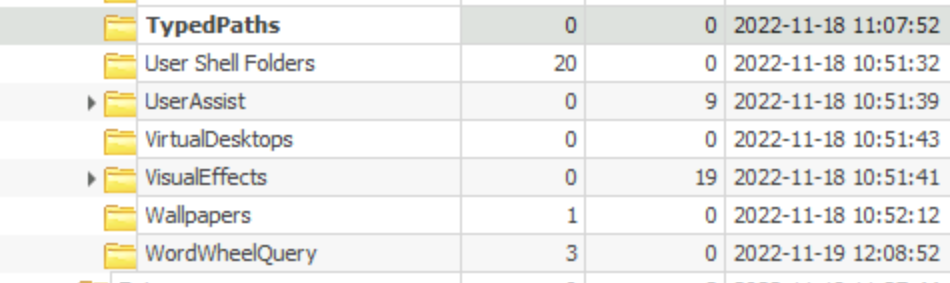
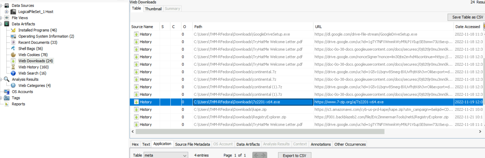
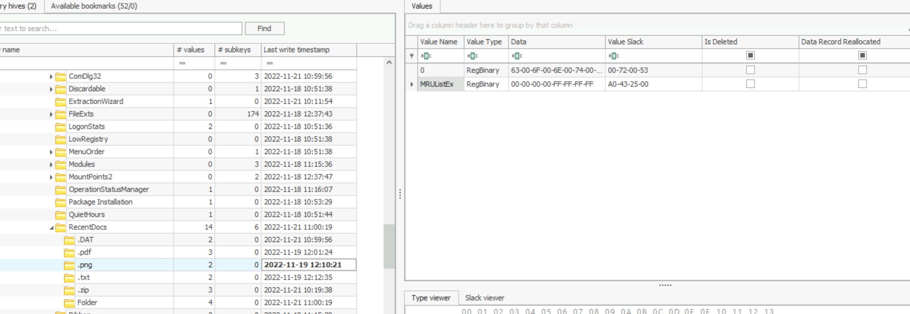
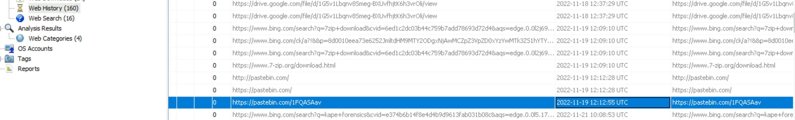
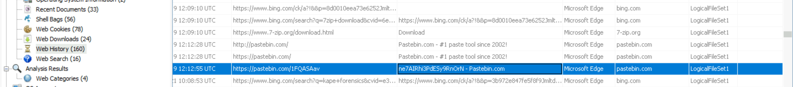

# Unattended

Scenario: Welcome to the team, kid. I have something for you to get your feet wet.
Our client has a newly hired employee who saw a suspicious-looking janitor exiting his office as he was about to return from lunch.
I want you to investigate if there was user activity while the user was away between 12:05 PM to 12:45 PM on the 19th of November 2022. If there are, figure out what files were accessed and exfiltrated externally.
You'll be accessing a live system, but use the disk image already exported to the C:\Users\THM-RFedora\Desktop\kape-results\C directory for your investigation. The link to the tools that you'll need is in C:\Users\THM-RFedora\Desktop\tools 
Finally, I want to remind you that you signed an NDA, so avoid viewing any files classified as top secret. I don't want us to get into trouble.


1. What file type was searched for using the search bar in Windows Explorer?

So there are 2 registries related to searches in Windows Explorer, `wordwheelquery` and `TypedPaths` we can check the 2 keys in registry explorer.


2. What top-secret keyword was searched for using the search bar in Windows Explorer?

Same location as the above answer.

3. What is the name of the downloaded file to the Downloads folder?

To check the downloads, we will use Autopsy. After opening a new case, we will go to the web history. There is only 1 entry with a weird name


4. When was the file from the previous question downloaded? (YYYY-MM-DD HH:MM:SS UTC)
You can check the answer at the same location as the above answer.

5. Thanks to the previously downloaded file, a PNG file was opened. When was this file opened? (YYYY-MM-DD HH:MM:SS)
To check when was a PNG opened, we can check the `RecentDocs` key, which will show the latest entry of a PNG file


7. A text file was created in the Desktop folder. How many times was this file opened?
Since a txt file is most likely created by notepad.exe, and notepad is a jumplist available software, we can use jumplist to check this out. Use Eric Zimmerman's tool.
```
--- AppId information ---
  AppID: 9b9cdc69c1c24e2b
  Description: Notepad 64-bit

--- DestList information ---
  Expected DestList entries:  1
  Actual DestList entries:    1
  DestList version:           4

--- DestList entries ---
Entry #: 1
  MRU: 0
  Path: C:\Users\THM-RFedora\Desktop\launchcode.txt
  Pinned: False
  Created on:    2022-11-19 11:45:46
  Last modified: 2022-11-19 12:12:35
  Hostname: tryhatme-rfedor
  Mac Address: 02:aa:8b:ff:d5:25
  Interaction count: 2

--- Lnk information ---
  Absolute path: My Computer\C:\Users\\Desktop\

```

7. When was the text file from the previous question last modified? (MM/DD/YYYY HH:MM)
Can be answered as with the above output

8. The contents of the file were exfiltrated to pastebin.com. What is the generated URL of the exfiltrated data?


9. What is the string that was copied to the pastebin URL?

Above 2 questions can be answered at the same place, we will use autopsy again to check the web history, it shows that during the suspected time frame, there are only 3 pastedbin entries. 

